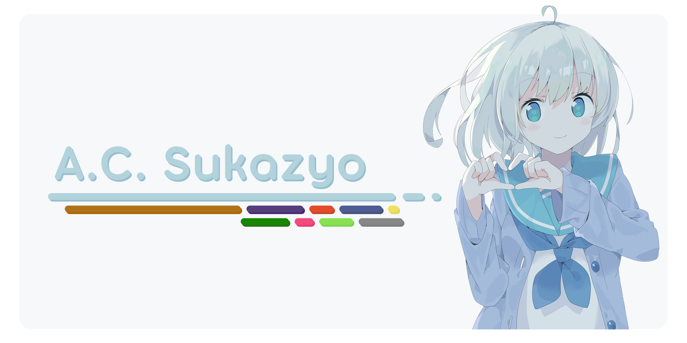

~~吃灰的 GitHub Account，女生自用99新~~

[WS Github][ws-gh] | [-ws-mvn][ws-mvn] | [~~WS Mainframe~~][ws-host] | [SomeOldParesu][ws-im-group]

[IM Chat][annie-tg] | [Private Networt][annie-network] | [Event(Mail)Box][annie-email]

[ws-gh]: https://github.com/suk-ws
[ws-host]: https://sukazyo.cc
[ws-im-group]: https://discord.sukazyo.cc
[ws-mvn]: https://mvn.sukazyo.cc
[annie-tg]: https://t.me/Eyre_S
[annie-network]: https://t.me/annie_prove_ship
[annie-email]: mailto:sukazyo@outlook.com

 

 

---

 

 

 

### About Here

GitHub Account Instance of A.C.Sukazyo Eyre[来源请求]✅:

/\*  
&nbsp;\* All of my code/projects here pushed.  
&nbsp;\* CI/CD not prepared.  
&nbsp;\* High integration of private projects and Workshop services.🎈

&nbsp;\* Love documentations, but poor on English.  
&nbsp;\* Welcome any type of issue/pr/pr... or... i'm welcomed to be bothered?

&nbsp;\* Only do follow someones are coding.  
&nbsp;\* 🎉 Java is a plus for followed.  
&nbsp;\* Every OOP language is a plus! well, except kt.  
&nbsp;\* KOTLIN IS A MINUS 🎊.  
&nbsp;\* Procedural programming will be a minus.  
&nbsp;\* Well, C++ will not, it is a plus.  
&nbsp;\* but Python is a huge minus.  
&nbsp;\* and JavaScript is a HHHUUUUGGGEEE MINUS.  
&nbsp;\* well.. except frontend develop (for theres also CSS 🪅).

&nbsp;\* HARD TAB YES!  
&nbsp;\* HARD TAB YES!!  
&nbsp;\* HARD TAB YES!!!  
&nbsp;\* HARD TAB YES!!!!  
&nbsp;\*/

 

### 活跃项目列表

[repo-suk-icee]:      https://github.com/Eyre-S/System-iCee
[repo-suk-untitled]:  https://github.com/Eyre-S/Untitled
[repo-suk-res]:       https://github.com/Eyre-S/ResourceTools
[repo-suk-srv]:       https://github.com/Eyre-S/ws-services
[repo-suk-phb]:       https://github.com/Eyre-S/ph-Bookshelf
[repo-suk-ca]:        https://github.com/Eyre-S/CreatureAlchemy
[repo-suk-cacao]:     https://github.com/Eyre-S/Cacao-Note
[repo-suk-pixelva]:   https://github.com/Eyre-S/pixelva
[repo-suk-sstb]:      https://github.com/Eyre-S/SS-Tool-Box
[repo-suk-morny]:     https://github.com/Eyre-S/Coeur-Morny-Cono
[repouser-timi]:      https://github.com/Timicasto
[repo-timi-qmod]:     https://github.com/Timicasto/Quantum-Mod
[repouser-ws]:        https://github.com/suk-ws
[repo-ws-icee]:       https://github.com/suk-ws/System-iCee
[repo-ws-phb]:        https://github.com/suk-ws/ph-Bookshlef
[repo-ws-hytrans]:    https://github.com/suk-ws/hytrans
[repo-ws-pixelva]:    https://github.com/suk-ws/pixelva
[repo-ws-messiva]:    https://github.com/suk-ws/messiva
[repo-ws-ghlm]:       https://github.com/suk-ws/Github-Label-Manager
[repouser-pd2]:       https://github.com/pd2-works
[repo-pd2-psh]:       https://github.com/pd2-works/psh
[repouser-ss]:        https://github.com/Stapxs
[repo-ss-sstb]:       https://github.com/Stapxs/SS-Tool-Box

[lrepo]:              https://gitlab.lama3l9r.net
[lrepouser-lama]:     https://gitlab.lama3l9r.net/lama
[lrepo-lama-osugcs]:  https://gitlab.lama3l9r.net/lama/osugcs
[lrepo-lama-jsph]:    https://vc.lama3l9r.net/lama/josephbot-homebase
[lrepo-lama-qmod]:    https://gitlab.lama3l9r.net/lama/quantun-mod

> PHP Web 应用程序
>
> - 🔒[ws-services][repo-suk-srv]
> - [ph-Bookshelf][repo-suk-phb] >> [Sukazyo Workshop][repouser-ws]/[ph-Bookshelf][repo-ws-phb]
>
> Wordpress 主题
>
> - [Cacao Note][repo-suk-cacao]
>
> Java 应用程序
>
> - [System iCee][repo-suk-icee] >> [Sukazyo Workshop][repouser-ws]/[System iCee][repo-ws-icee]
> - [Coeur Morny Cono][repo-suk-morny]
> - [Pd2 CodeWork Center][repouser-pd2]/[psh][repo-pd2-psh]
> - [Untitled][repo-suk-untitled]‘java.cli `(综合性的 java util 库的命令行端口)`
>
> Java API
>
> - [Untitled][repo-suk-untitled]‘java `(综合性的 java util 库)`
> - [pixelva][repo-suk-pixelva].canvas >> [Sukazyo Workshop][repouser-ws]/[pixelva][repo-ws-pixelva].canvas
> - [pixelva][repo-suk-pixelva].colorpane >> [Sukazyo Workshop][repouser-ws]/[pixelva][repo-ws-pixelva].colorpane
> - [Sukazyo Workshop][repouser-ws]/[messiva][repo-ws-messiva]
> - [ResourceTools][repo-suk-res]`(Coming soon...)`
>
> C# 桌面应用程序
>
> - [SS-Tool-Box][repo-suk-sstb] >> [Stapx Steve][repouser-ss]/[SS-Tool-Box][repo-ss-sstb]
> - [Sukazyo Workshop][repouser-ws]/[Github Label Manager][repo-ws-ghlm]
>
> Minecraft Mod
>
> - [Creature Alchemy][repo-suk-ca]
>
> 杂项
>
> - [Untitled][repo-suk-untitled]
> - [Sukazyo Workshop][repouser-ws]/[hytrans][repo-ws-hytrans]

### 已完成的项目列表

*即暂时没有新功能计划，只进行维护工作的项目*

> 暂无..真的&.&
>
> 不过 [untitled][repo-suk-untitled] 里倒是有存一堆小东西..算是“完成”的&？

### 计划中项目列表

> Web 项目
>
> - MiiT Public PassPort `(实在无从下手&..)`
>
> Minecraft Mod
>
> - [Timicasto][repouser-timi]/[Quantum Mod][repo-timi-qmod] || [LamaVC][lrepo]::[pp lama][lrepouser-lama]/[QuantumMod][lrepo-lama-qmod]`(@Timicasto在重写，但是还没抽出时间去看)`
>
> Java API
>
> - osu!imgap-api
>
> Java 应用程序
>
> - [Pd2 CodeWork Center][repouser-pd2]/[psh][repo-pd2-psh]`(毕竟pd2都死掉了..不清楚近况..(@maxelblack(小声 )`
> - osu!imgap-cli

### 死掉的项目列表

> Web 项目
>
> - MixedVoidNetwork `(mvn.sukazyo.cc，因为感觉没有必要了所以胎死腹中)`
>
> Java 应用程序
>
> - 🔒~~[LamaVC][lrepo]::[lama][lrepouser-lama]/[JosephBot][lrepo-lama-jsph]~~`(之前关注过，现在大概是死了)`
> - 🔒[LamaVC][lrepo]::[pp lama][lrepouser-lama]/[osugcs][lrepo-lama-osugcs]`(曾经帮忙写过的javaweb项目，现在毕竟已经过去使用时间了，不清楚会不会有续用，和lama也没有联系了)`
>
> ~~没有更多了（确信~~

 

	更多内容监修中
